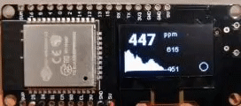

# DIY, low cost esp-platform based CO2 monitor ;-)

> **This project is under development!!!** \
> **Current release should work for real-time CO2 monitoring 'out-of-the-box'.**

This repository contains the firmware source code for a low-cost CO2 monitor built using [platform.io](https://docs.platformio.org/en/latest/what-is-platformio.html) framework, and standard ESP modules such Wemos Lolin32 and clones.

Check [wiki](https://github.com/oskrs111/diy-co2-monitor/wiki) for details.

## **Features**

- Realtime CO2 level (ppm) monitoring.
- 60 points historical data graph (with configurable average time).
- BLE interface for wifi setup using 3rd party app.
- Web dashboard for big display monitoring.
- More coming soon...

MIT License. \

