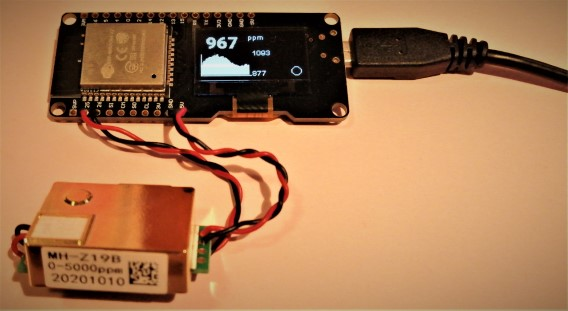
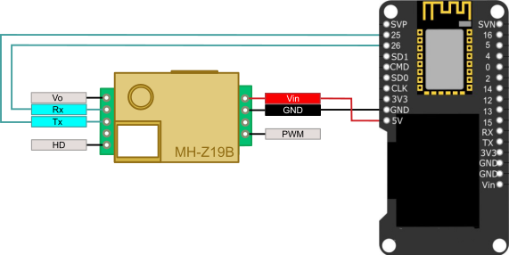
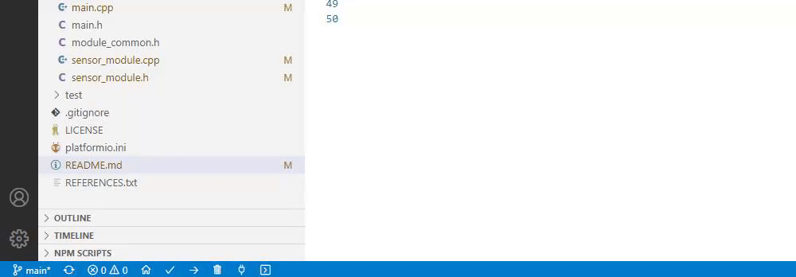
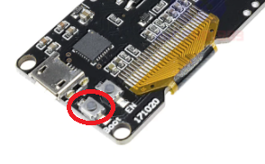
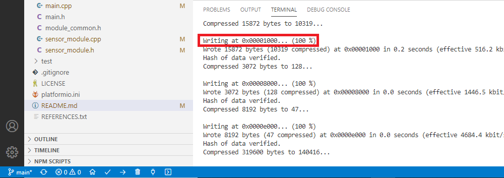
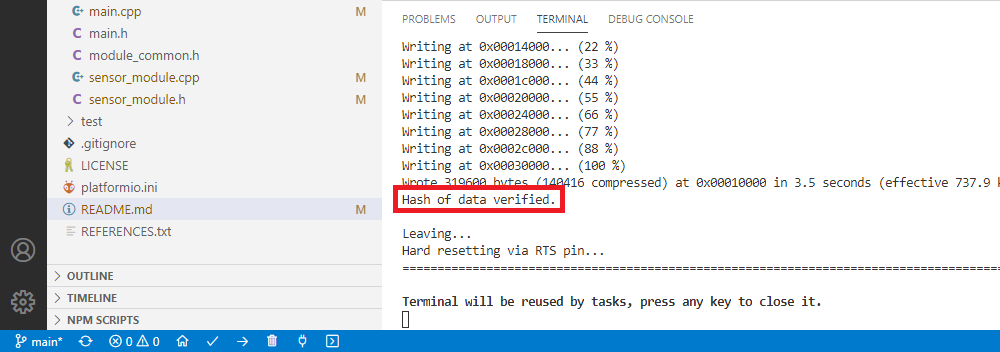

## **diy-co2-monitor**
# DIY, low cost esp-platform based CO2 monitor ;-) 

> **This project is under development!!!** \
> **Current release should work for real-time CO2 monitoring 'out-of-the-box'.**

This repository contains the firmware source code for a low-cost CO2 monitor built using [platform.io](https://docs.platformio.org/en/latest/what-is-platformio.html) framework, and standard ESP modules such Wemos Lolin32 and clones.

Current hardware setup, includes support for (total cost about 22€):
- Wemos Lolin32 OLED Board and clones (ESP-WROOM-32).
- MH-Z19B CO2 Sensor (0-5000ppm +/-50ppm range).

## **Features**
- Realtime CO2 level (ppm) monitoring.
- 60 points historical data graph (with configurable average time).

## **Sensor wiring**
As the ESP module is able to run supplied from standard USB Smartphone charger, it is only need to wire 4 cables between ESP module and MH-Z19B Sensor:

ESP module | MH-Z19B Sensor
-----------|----------------
5V         | Vin
GND        | GND
PIN 25     | Tx
PIN 26     | Rx

## **Compile and run**
- Install [Visual Studio Code](https://code.visualstudio.com/Download).
- Install [platform.io plugin](https://platformio.org/install/ide?install=vscode).
- Clone (or download) this [repository](https://github.com/oskrs111/diy-co2-monitor/archive/main.zip).
- Open folder with Visual Studio Code.
- Wait to platform.io plugin to load.
- Click on Build button (platform.io lower toolbar V) and wait until **=== [SUCCESS] ===** banner appears.

- Connect board to computer using a USB cable (in Windows 10, drivers will install automatically).
- Press and keep pressing tiny **Boot** button located on the rear side of the PCB.

- Click on Upload button (platform.io lower toolbar ->).
- Keep pressing tiny **Boot** button until **Writing at 0x00001000... (100 %)** line appears, and then release it.

- Wait until the firmware upload is finished, program will boot automatically.

## **Where to get parts** (I have not any relation nor benefit with these shops)
### Wemos Lolin32 OLED Board (clone):
- Aliexpress searching for [ESP32 ESP-WROOM-32 OLED](https://es.aliexpress.com/item/33010287082.html?spm=a2g0o.productlist.0.0.740167a6NWIN4W).

### MH-Z19B CO2 NDIR Sensor:
- Aliexpress searching for [MH-Z19B](https://es.aliexpress.com/item/4000212024923.html?spm=a2g0o.productlist.0.0.5527330bYB0f9I)

MIT License. \

